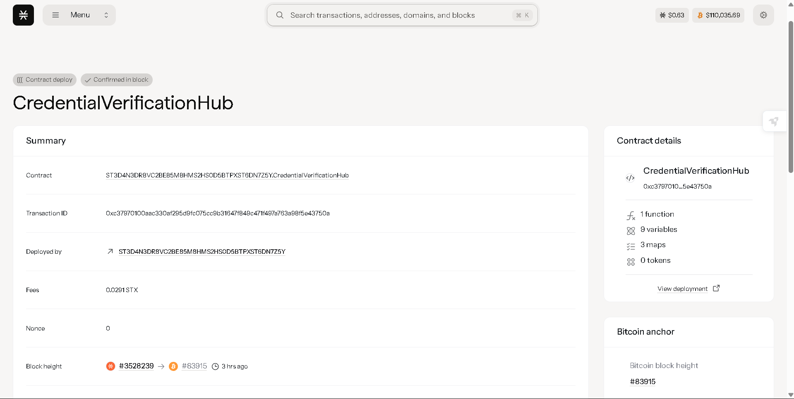

# CredentialVerification Hub

## Project Title
**CredentialVerification Hub** - Blockchain-Based Academic and Professional Credential Verification System

## Project Description

The CredentialVerification Hub is a revolutionary blockchain-based platform built on the Stacks network using Clarity smart contracts. This system enables secure verification of academic degrees and professional certifications without exposing personal information of credential holders.

### Key Features:
- **Privacy-Preserving Verification**: Uses cryptographic hashing to verify credentials without revealing personal details
- **Zero-Knowledge Proof Concepts**: Only proves credential validity without disclosing sensitive information
- **Institutional Authorization**: Only verified educational institutions and certification bodies can issue credentials
- **Immutable Records**: Blockchain-based storage ensures tamper-proof credential records
- **Real-Time Verification**: Instant credential authenticity verification for employers and organizations
- **Transparent Audit Trail**: Complete verification history while maintaining privacy

### How It Works:
1. **Credential Issuance**: Authorized institutions generate cryptographic hashes of credentials and store them on-chain
2. **Credential Verification**: Anyone can verify a credential's authenticity using only the credential hash
3. **Privacy Protection**: Personal information never leaves the institution's secure systems
4. **Trust Network**: Institutions must be pre-authorized by the contract owner to maintain system integrity

## Project Vision

Our vision is to create a global, decentralized infrastructure for credential verification that:

- **Eliminates Credential Fraud**: Provides an immutable, tamper-proof system for credential verification
- **Protects Privacy**: Ensures personal information remains confidential while enabling verification
- **Reduces Verification Time**: Transforms weeks-long verification processes into instant confirmations  
- **Increases Global Mobility**: Enables seamless credential recognition across borders and institutions
- **Builds Digital Trust**: Creates a universal standard for credential authenticity in the digital age
- **Democratizes Education**: Provides equal verification opportunities regardless of geographic location
- **Supports Lifelong Learning**: Facilitates continuous professional development with verifiable micro-credentials

### Core Principles:
- **Privacy First**: Personal data protection is paramount
- **Decentralization**: No single point of failure or control
- **Transparency**: Open verification process with auditable results
- **Accessibility**: Equal access to verification services globally
- **Interoperability**: Compatible with existing educational and professional systems

## Future Scope

### Phase 1: Foundation (Current)
- ✅ Basic credential issuance and verification
- ✅ Institution authorization system
- ✅ Privacy-preserving verification mechanism

### Phase 2: Enhanced Features (Next 6 months)
- **Batch Verification**: Support for verifying multiple credentials simultaneously
- **Credential Expiry Management**: Time-based credential validity and renewal
- **Advanced Institution Types**: Support for professional bodies, online learning platforms, and certification authorities
- **Mobile Integration**: Native mobile apps for iOS and Android
- **API Development**: RESTful APIs for third-party integrations

### Phase 3: Advanced Capabilities (6-12 months)
- **Selective Disclosure**: Allow partial credential information sharing (e.g., graduation year without degree details)
- **Cross-Chain Compatibility**: Integration with Ethereum, Bitcoin, and other blockchain networks
- **AI-Powered Fraud Detection**: Machine learning algorithms to identify suspicious verification patterns
- **Digital Badges**: NFT-based credential representations for social media and professional profiles
- **Employer Dashboard**: Comprehensive verification management system for HR departments

### Phase 4: Global Expansion (12-18 months)
- **International Standards Compliance**: Integration with global educational frameworks (European Qualifications Framework, etc.)
- **Multi-Language Support**: Platform localization for global markets
- **Government Integration**: Partnership with national education ministries and professional licensing boards
- **Micro-Credential Ecosystem**: Support for skills-based certifications and nano-degrees
- **Blockchain Interoperability Protocol**: Universal credential verification across all major blockchain networks

### Phase 5: Advanced Analytics (18+ months)
- **Credential Analytics**: Insights into skill gaps, educational trends, and workforce development
- **Predictive Verification**: AI-powered pre-verification of credentials before formal issuance
- **Smart Contracts 2.0**: Advanced programmable credential logic with conditional verification
- **Decentralized Identity Integration**: Full compatibility with W3C DID standards
- **Global Credential Marketplace**: Platform for educational institutions to offer verified courses and certifications

### Long-term Vision:
- **Universal Credential Standard**: Become the global standard for credential verification
- **Educational Blockchain Infrastructure**: Foundation layer for all educational record-keeping
- **Skills-Based Economy Support**: Enable the transition to competency-based hiring
- **Lifelong Learning Companion**: Personal credential wallet for continuous professional development
- **Global Education Equity**: Reduce barriers to educational recognition worldwide

### Technical Roadmap:
- **Layer 2 Solutions**: Implement scaling solutions for high-volume verification
- **Quantum-Resistant Cryptography**: Prepare for post-quantum security requirements
- **Decentralized Storage**: Integration with IPFS and Arweave for credential metadata
- **Zero-Knowledge Proofs**: Advanced ZK-SNARK implementation for enhanced privacy
- **Governance Token**: Community-driven platform governance and decision-making

## Contract Address Details
Contract ID: ST3D4N3DR8VC2BE85M8HMS2HS0D5BTPXST6DN7Z5Y.CredentialVerificationHub


### Contract Functions:

#### Primary Functions:
1. **`issue-credential`**: Allows authorized institutions to issue new credentials
   - Parameters: `credential-hash`, `institution-id`, `credential-type`
   - Access: Authorized institutions only

2. **`verify-credential`**: Enables anyone to verify credential authenticity
   - Parameters: `credential-hash`
   - Access: Public (anyone can verify)

#### Administrative Functions:
- **`add-authorized-institution`**: Authorize new institutions (owner only)
- **`revoke-institution-authorization`**: Remove institution authorization (owner only)

#### Read-Only Functions:
- **`get-total-credentials`**: Get total number of credentials issued
- **`get-total-verifications`**: Get total number of verifications performed
- **`is-institution-authorized`**: Check if an institution is authorized
- **`get-verification-count`**: Get verification count for a specific verifier

### Integration Examples:

#### Issuing a Credential (Institution):
```clarity
(contract-call? .credential-verification-hub issue-credential 
  0x1a2b3c4d5e6f7890abcdef1234567890abcdef1234567890abcdef1234567890
  "MIT-EDU-001"
  "academic")
```

#### Verifying a Credential (Anyone):
```clarity
(contract-call? .credential-verification-hub verify-credential
  0x1a2b3c4d5e6f7890abcdef1234567890abcdef1234567890abcdef1234567890)
```

---

## Getting Started

### For Educational Institutions:
1. Contact the contract owner to get authorized as a credential issuer
2. Generate cryptographic hashes for student credentials
3. Use the `issue-credential` function to register credentials on-chain
4. Provide credential holders with their unique credential hashes

### For Employers/Verifiers:
1. Request credential hash from job applicants
2. Use the `verify-credential` function to check authenticity
3. Review verification results to confirm credential validity
4. Make hiring decisions based on verified credentials

### For Developers:
1. Clone the repository and review the Clarity contract code
2. Deploy to Stacks testnet for development and testing
3. Integrate verification functionality into your applications
4. Use the provided API examples for seamless integration

---


